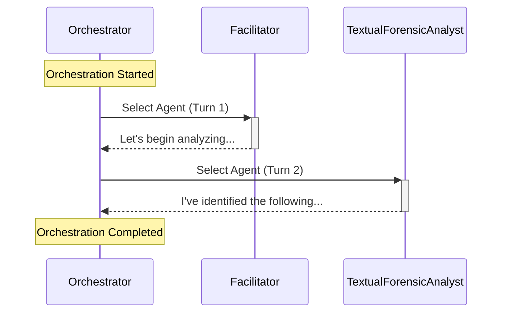

# Workflow Logging System

## Overview

The new workflow logging system provides comprehensive, structured logging for agent orchestration workflows. It offers:

- **Beautiful Console Output**: Formatted, easy-to-read logs with clear visual separation
- **Full Content Display**: No more truncated responses - see complete agent outputs
- **Performance Metrics**: Track tokens, duration, and turn counts per agent
- **Workflow Visualization**: Export to JSON and generate Mermaid sequence diagrams
- **Configurable Verbosity**: Control logging detail level without code changes
- **Structured Events**: All events are logged with metadata for analysis

## What's New

### Before
```
[Facilitator]
Let's begin analyzing this documentation. I'll coordinate with the team to extract evidence syst...
```

### After (Standard Verbosity)
```
================================================================================
  ORCHESTRATION STARTED
================================================================================
  Max Turns: 30
  Timeout: 15 minutes
================================================================================

--------------------------------------------------------------------------------
  Agent Selected: Facilitator
  Reason: First agent in orchestration
--------------------------------------------------------------------------------

  [Facilitator]
  (342 tokens, 1234ms)

  Let's begin analyzing this documentation. I'll coordinate with
  the team to extract evidence systematically. We need to identify
  facts and key assumptions from the provided context...
  [Full content displayed]

--------------------------------------------------------------------------------
  Agent Selected: TextualForensicAnalyst
  Reason: Round-robin selection after Facilitator
--------------------------------------------------------------------------------
  Handoff: Facilitator -> TextualForensicAnalyst
  Reason: Round-robin manager selected next agent

  [TextualForensicAnalyst]
  (567 tokens, 2341ms)

  [Full analysis content...]

================================================================================
  ORCHESTRATION COMPLETED
================================================================================
  Total Turns: 12
  Duration: 34.5s
  Total Tokens: 4,521
  Termination: Orchestration completed successfully
  Results: 8 items extracted

  Turns by Agent:
    - Facilitator: 3
    - TextualForensicAnalyst: 3
    - DomainSubjectMatterExpert: 2
    - AssumptionAndBiasAuditor: 2
    - Contrarian: 2

  Tokens by Agent:
    - TextualForensicAnalyst: 1,234
    - Facilitator: 987
    - DomainSubjectMatterExpert: 856
    - AssumptionAndBiasAuditor: 734
    - Contrarian: 710
================================================================================
```

## Configuration

Add or update the `OrchestrationSettings` section in your `appsettings.json`:

```json
{
  "OrchestrationSettings": {
    "MaximumInvocationCount": 30,
    "TimeoutInMinutes": 15,

    // Logging Configuration
    "LogVerbosity": "Standard",
    "EnableWorkflowVisualization": true,
    "ShowFullResponseContent": true,
    "SaveWorkflowToFile": false,
    "WorkflowLogDirectory": "./workflow_logs"
  }
}
```

### Configuration Options

#### LogVerbosity
Controls how much information is logged to the console.

- **`Minimal`**: Only start and completion messages
- **`Standard`**: Agent selections, handoffs, and response previews (default)
- **`Detailed`**: Everything in Standard plus full response content
- **`Debug`**: Everything including termination checks and internal decisions

#### ShowFullResponseContent
- **`true`**: Display complete agent responses (default)
- **`false`**: Display truncated previews (first 200 characters)

#### EnableWorkflowVisualization
- **`true`**: Enable JSON export and Mermaid diagram generation (default)
- **`false`**: Disable visualization features

#### SaveWorkflowToFile
- **`true`**: Automatically save workflow events to JSON file after completion
- **`false`**: Don't save to file (default)

#### WorkflowLogDirectory
- Path where workflow log files will be saved (if `SaveWorkflowToFile` is true)
- Default: `"./workflow_logs"`

## Features

### 1. Structured Event Logging

All workflow events are captured with detailed metadata:

```csharp
public enum WorkflowEventType
{
    OrchestrationStarted,
    AgentSelected,
    AgentResponseReceived,
    HandoffDecision,
    TerminationCheck,
    ResultFiltered,
    OrchestrationCompleted,
    Error
}
```

Each event includes:
- Timestamp
- Event type
- Agent name (if applicable)
- Reason/explanation
- Content
- Turn number
- Duration and token counts
- Custom metadata

### 2. Performance Metrics

Track important performance indicators:
- **Response Duration**: Time taken for each agent response
- **Token Count**: Tokens used per agent and in total
- **Turn Distribution**: Which agents spoke most often
- **Total Duration**: Complete orchestration execution time

### 3. Workflow Visualization

#### JSON Export

Access workflow data programmatically:

```csharp
// In your code after orchestration completes
var workflowLogger = serviceProvider.GetRequiredService<WorkflowLogger>();
string json = workflowLogger.ExportToJson();
```

Sample JSON structure:
```json
{
  "Summary": {
    "StartTime": "2025-12-01T10:30:00Z",
    "EndTime": "2025-12-01T10:30:45Z",
    "DurationMs": 45000,
    "TotalTurns": 12,
    "TotalTokens": 4521,
    "TerminationReason": "Orchestration completed successfully",
    "ResultCount": 8,
    "TurnsByAgent": {
      "Facilitator": 3,
      "TextualForensicAnalyst": 3
    }
  },
  "Events": [...]
}
```

#### Mermaid Sequence Diagrams

Generate visual workflow diagrams:

```csharp
var workflowLogger = serviceProvider.GetRequiredService<WorkflowLogger>();
string mermaid = workflowLogger.GenerateMermaidDiagram();
```

Output:


### 4. Automatic File Saving

Enable automatic saving of workflow logs:

```json
{
  "OrchestrationSettings": {
    "SaveWorkflowToFile": true,
    "WorkflowLogDirectory": "./workflow_logs"
  }
}
```

Files are named with timestamps:
```
workflow_logs/
  workflow_20251201_103045.json
  workflow_20251201_141522.json
```

## Architecture

### New Components

#### Models
- **`WorkflowEvent.cs`**: Event data structures and types
- **`WorkflowSummary.cs`**: Summary statistics (included in WorkflowEvent.cs)

#### Services
- **`WorkflowLogger.cs`**: Core logging service
  - Captures all workflow events
  - Manages summary statistics
  - Provides export functionality

- **`ConsoleFormatter.cs`**: Console output formatting
  - Beautiful, structured console output
  - Configurable content display
  - Consistent visual styling

### Integration Points

The logging system integrates at these key points:

1. **`EvidenceExtractionOrchestrationFactory.cs`**
   - Logs orchestration lifecycle (start/complete)
   - Tracks agent selections and handoffs
   - Captures full response content
   - Extracts performance metrics
   - Handles error logging

2. **`Program.cs`**
   - Registers `ConsoleFormatter` as singleton
   - Registers `WorkflowLogger` as scoped service
   - Available via dependency injection

3. **`OrchestrationSettings.cs`**
   - Centralized configuration
   - All logging options in one place

## Usage Examples

### Example 1: Default Configuration (Standard Verbosity)

```json
{
  "OrchestrationSettings": {
    "LogVerbosity": "Standard",
    "ShowFullResponseContent": true
  }
}
```

**Output**: Agent selections, handoffs, full responses, summary statistics

### Example 2: Minimal Logging for Production

```json
{
  "OrchestrationSettings": {
    "LogVerbosity": "Minimal",
    "ShowFullResponseContent": false,
    "SaveWorkflowToFile": true
  }
}
```

**Output**: Only start/complete messages in console, full details saved to file

### Example 3: Maximum Detail for Debugging

```json
{
  "OrchestrationSettings": {
    "LogVerbosity": "Debug",
    "ShowFullResponseContent": true,
    "EnableWorkflowVisualization": true,
    "SaveWorkflowToFile": true
  }
}
```

**Output**: Everything logged to console and file, ready for analysis

### Example 4: Quick Preview Mode

```json
{
  "OrchestrationSettings": {
    "LogVerbosity": "Standard",
    "ShowFullResponseContent": false
  }
}
```

**Output**: See workflow progress without overwhelming console with full content

## Benefits

### For Development
- **Quick Debugging**: See exactly what each agent is doing
- **Performance Optimization**: Identify slow agents or token-heavy operations
- **Flow Understanding**: Visualize conversation progression

### For Production
- **Audit Trail**: Complete record of orchestration decisions
- **Analytics**: Extract patterns from workflow data
- **Troubleshooting**: Detailed error context and stack traces

### For Research
- **Reproducibility**: Export complete workflow for analysis
- **Comparison**: Compare different orchestration strategies
- **Documentation**: Generate diagrams for papers/presentations

## Logging Output Locations

The new system uses multiple output channels:

1. **Console**: Formatted, human-readable output (controlled by `LogVerbosity`)
2. **ILogger**: Structured logs for ASP.NET Core logging infrastructure
3. **JSON Files**: Complete event data (if `SaveWorkflowToFile` is enabled)
4. **In-Memory**: Events accessible via `WorkflowLogger.Events` property

## Migration Notes

### What Changed

**Before:**
- Agent responses truncated to 100 characters
- Only basic console output via `Console.WriteLine`
- No performance metrics
- No workflow summary

**After:**
- Full agent responses (configurable)
- Structured, formatted console output
- Complete performance tracking
- Comprehensive workflow summary with statistics

### Backward Compatibility

- No breaking changes to existing code
- All previous functionality preserved
- Configuration is optional (sensible defaults provided)
- Can gradually adopt new features

## Advanced: Custom Logging

The `WorkflowLogger` service is available via DI and can be used in custom orchestration factories:

```csharp
public class CustomOrchestrationFactory : IOrchestrationFactory<MyResult>
{
    private readonly WorkflowLogger _workflowLogger;

    public CustomOrchestrationFactory(WorkflowLogger workflowLogger)
    {
        _workflowLogger = workflowLogger;
    }

    public async Task<MyResult> ExecuteCoreAsync(string input, CancellationToken ct)
    {
        _workflowLogger.LogOrchestrationStart("Custom task", 10, 5);

        try
        {
            // Your orchestration logic
            _workflowLogger.LogAgentSelection("MyAgent", "Custom reason", 1);

            // ...

            _workflowLogger.LogOrchestrationComplete("Success", resultCount);
            return result;
        }
        catch (Exception ex)
        {
            _workflowLogger.LogError("Failed", ex);
            throw;
        }
    }
}
```

## Troubleshooting

### Issue: No console output

**Solution**: Check `LogVerbosity` setting. Set to `Standard` or higher.

### Issue: Content still truncated

**Solution**: Ensure `ShowFullResponseContent` is `true` and `LogVerbosity` is `Detailed` or higher.

### Issue: File not created

**Solution**:
1. Check `SaveWorkflowToFile` is `true`
2. Ensure `WorkflowLogDirectory` exists or app has permissions to create it
3. Check for exceptions during save operation

### Issue: Missing performance metrics

**Solution**: Token counts depend on AI service metadata. Some services may not provide this information.

## Future Enhancements

Potential additions in future versions:
- Real-time streaming to external monitoring systems
- Integration with Application Insights or similar APM tools
- Custom event handlers for specific workflow events
- Workflow comparison and diff tools
- Performance regression detection

## Summary

The new workflow logging system transforms agent orchestration from a black box into a transparent, observable process. With configurable verbosity, comprehensive metrics, and multiple export formats, you can now:

✅ **See** exactly what agents are doing
✅ **Understand** workflow patterns and decisions
✅ **Optimize** performance with detailed metrics
✅ **Debug** issues with complete context
✅ **Analyze** workflows with structured data
✅ **Document** processes with generated diagrams

All while maintaining backward compatibility and requiring minimal configuration.
